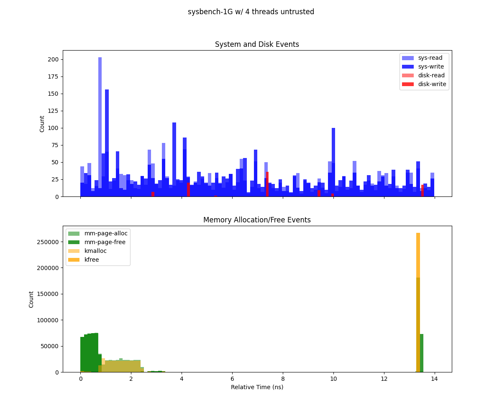
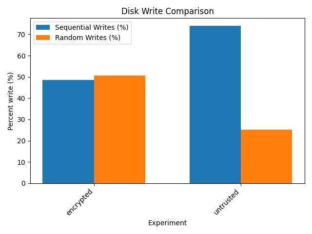

Analyzing data 
-----------------

Preprocessing
~~~~~~~~~~~~~

To aggregate sample data with mean and standard deviation, a
preprocessing step is required. This is accomplished using the script
``dev/aggregate.py``. The script processes the raw data collected during
benchmarking and computes the necessary statistical measures for
analysis.

Setting Up the Environment
^^^^^^^^^^^^^^^^^^^^^^^^^^

Before running the preprocessing script, ensure that you have a suitable
Python environment. You can create a virtual environment and install the
necessary dependencies using the ``requirements.txt`` file. This ensures
that all required packages are available for the script to run smoothly.

.. code:: sh

   python3 -m venv env
   source env/bin/activate
   pip install -r requirements.txt

Preprocessing Script
^^^^^^^^^^^^^^^^^^^^

The ``dev/aggregate.py`` script requires two arguments to function
correctly:

1. **Path to the TOML File**: This is the configuration file used during
   the benchmarking process. It contains the parameters and tasks that
   were executed.

2. **Output Directory**: This is the directory where the aggregated data
   will be stored after processing.

To run the script, use the following command:

.. code:: sh

   python dev/aggregate.py <path/to/toml> <path/to/output_directory>

For example, running the following commands produces:

.. code:: sh

   python dev/aggregate.py examples/demo.toml aggregated
   tree aggregated

   aggregated/
   ├── dd-1
   │   ├── deep-trace
   │   │   ├── io.csv
   │   │   ├── package-0-core.csv
   │   │   ├── package-0.csv
   │   │   ├── perf.csv
   │   │   ├── stderr
   │   │   ├── stdout
   │   │   └── trace.csv
   │   ├── io.csv
   │   ├── package-0-core.csv
   │   ├── package-0.csv
   │   └── perf.csv
   ├── nbody-1
   │   ├── deep-trace
   │   │   ├── io.csv
   │   │   ├── package-0-core.csv
   │   │   ├── package-0.csv
   │   │   ├── perf.csv
   │   │   ├── stderr
   │   │   ├── stdout
   │   │   └── trace.csv
   │   ├── io.csv
   │   ├── package-0-core.csv
   │   ├── package-0.csv
   │   └── perf.csv
   ├── nbody-2
   │   ├── deep-trace
   │   │   ├── io.csv
   │   │   ├── package-0-core.csv
   │   │   ├── package-0.csv
   │   │   ├── perf.csv
   │   │   ├── stderr
   │   │   ├── stdout
   │   │   └── trace.csv
   │   ├── io.csv
   │   ├── package-0-core.csv
   │   ├── package-0.csv
   │   └── perf.csv
   └── nbody-4
       ├── deep-trace
       │   ├── io.csv
       │   ├── package-0-core.csv
       │   ├── package-0.csv
       │   ├── perf.csv
       │   ├── stderr
       │   ├── stdout
       │   └── trace.csv
       ├── io.csv
       ├── package-0-core.csv
       ├── package-0.csv
       └── perf.csv

Perf Aggregation
^^^^^^^^^^^^^^^^

Perf output is aggregated by calculating the mean and standard deviation
for each counter. The output appears as follows.

.. code:: sh

   cat /tmp/demo-processed/bonnie++-1-untrusted/perf.csv

   event,counter_mean,counter_std,counter_unit,metric_mean,unit_metric,perc_runtime_mean
   L1-dcache-load-misses,5113360521.6,103267837.73247407,,3.4019999999999997,of all L1-dcache accesses,31.0
   L1-dcache-loads,150305474853.2,205182282.16844067,,1.1228,G/sec,31.0
   L1-dcache-prefetches,1269258560.2,52122983.51175186,,9.4724,M/sec,31.0
   L1-icache-load-misses,2304340677.4,19231482.942564532,,1.078,of all L1-icache accesses,31.0
   L1-icache-loads,214014918517.2,261940713.8728049,,1.5986,G/sec,31.0
   branch-instructions,80574228395.8,171678771.61877853,,601.847,M/sec,31.0
   branch-load-misses,9837754039.2,26359858.744911663,,73.4822,M/sec,31.0
   branch-loads,80564398959.6,163850241.16953686,,601.7755999999999,M/sec,31.0
   branch-misses,9836256318.8,24316591.9320201,,12.206,of all branches,31.0
   ....

Energy Measurement Aggregation
^^^^^^^^^^^^^^^^^^^^^^^^^^^^^^

Energy measurements are aggregated using the **coalescing window
method**. This involves grouping energy samples into fixed time
intervals, or **windows**, to align them with other data samples. By
default, the window size (``W``) is set to ``100ms``. Within each
window, energy samples are averaged to compute the mean and standard
deviation. This ensures energy data is accurately represented over
consistent time intervals, allowing for meaningful comparisons with
other metrics collected during benchmarking.

.. code:: sh

   head  /tmp/demo-processed/launch_nbody.sh-1-untrusted/package-0.csv

   ,bin,relative_time,energy (microjoule)
   0,0,0.0,20926838658.2
   1,50018408,500184086.0,22027975500.0
   2,50019136,500191369.0,21457430207.0
   3,50023813,500238137.0,19852073423.0
   4,50026094,500260940.0,20929957912.0
   5,50031162,500311624.0,20389345794.0
   6,100040329,1000403297.0,21462625388.0
   7,100047796,1000477967.0,19856279871.0
   8,100049695,1000496953.0,22029620099.0

Deep trace analysis
~~~~~~~~~~~~~~~~~~~

This figure (generate from ``deep-trace/trace.csv``) presents two histograms illustrating system events over the duration of a Sysbench run (1 GB workload, 8 threads), binned by relative time:

- **Top subplot (System and Disk Events)**  
  Depicts system calls (``sys-read``, ``sys-write``) and disk I/O events (``dsk-read``, ``dsk-write``). Each bar’s height indicates the count of that event type in the corresponding time bin. Notably, ``sys-read`` exhibits high spikes, suggesting periods of more intense read operations.

- **Bottom subplot (Memory Allocation/Free Events)**  
  Shows memory-related operations (``mm-page-alloc``, ``mm-page-free``, ``kmalloc``, ``kfree``). The concentration of allocations at the start indicates setup overhead, while the large cluster of frees at the end points to cleanup and deallocation.

  Sysbench executed using Gramine with 1Gb and 8 threads.

  Sysbench executed using Gramine with 1Gb and 4 threads.

  Sysbench executed using Gramine with 1Gb and 2 threads.

  Sysbench executed using Gramine with 1Gb and 1 thread.

  Sysbench executed without Gramine with 1 thread.

  Sysbench executed without Gramine with 2 threads.

  Sysbench executed without Gramine with 4 threads.

  Sysbench executed without Gramine with 8 threadss.

Disk write analysis
~~~~~~~~~~~~~~~~~~~

This bar chart compares the percentage of sequential and random disk writes between two configurations: ``encrypted`` and ``untrusted``.

- **Sequential Writes (%)** (blue bars):  
  - The ``untrusted`` configuration exhibits a significantly higher percentage of sequential writes compared to ``encrypted``.
  
- **Random Writes (%)** (orange bars):  
  - The ``encrypted`` configuration has a higher proportion of random writes compared to ``untrusted``, where random writes are notably lower.

  Disk write analysis for an enclave 128Mb size

  
  Disk write analysis for an enclave 64Mb size

